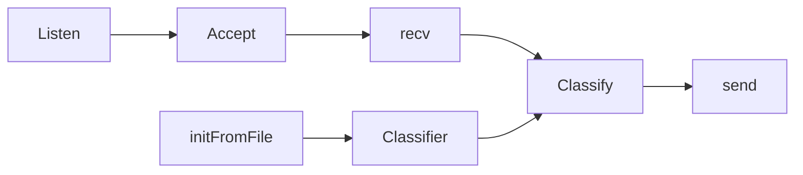
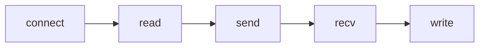

# KNN Classifier

This repository provides a server-side and a client-side system that
implements the  [k-nearest neighbors algorithm](https://en.wikipedia.org/wiki/K-nearest_neighbors_algorithm), 
using different metrics to classify new data, based on given data.

## Table Of Contents
[Getting Started](#Getting-Started)
* [Dependencies](#Dependencies)
* [Installation](#Installation)
* [Executing The Program](#Executing-The-Program)

[Design](#Design)
* [Distance](#Distance)
* [Classified and Classifier](#Classified-and-Classifier)
* [The Client And The Server](#The-Client-And-The-Server)

[Authors](#Authors)

[Acknowledgments](#Acknowledgments)


## Getting Started

### Dependencies

This project uses CMake to generate and build. In a Debian-based system you can install it via:
```bash
sudo apt install cmake
```

### Installation

Clone the repository:
```bash
git clone 'https://github.com/JonathanKelsi/Server-Client-KNN-Classifier'
```

### Executing The Program

To build the program, the standard CMake workflow can be used:
```bash
mkdir -p build && cd build
cmake ..
make -j && make
```

Running the server can be achieved by:
```bash
./Server
```
Running the client:
```bash
./Client [UNCLASSIFIED-DATA-PATH] [OUTPUT-PATH]
```

## Design

### Distance

In order to get another level of abstraction, we've created
the pure virtual class *Distance*, and gave it some concrete
subclasses, such as *EuclideanDistance*, *ManhattanDistance*
and *ChebyshevDistance*.
```c++
class Distance {
public:
    virtual double distance(const std::vector<double>& v1, const std::vector<double>& v2) const = 0;
     virtual ~Distance() = default;
};
```
The class represents an abstract metric, and is used
to achieve generality through polymorphism at the KNN classifier.

### Classified and Classifier

**Classified:** The classifier must classify something, and so, from the
need of representing a point in a dataset, this class was born.
```cpp
class Classified {
private:
    std::vector<double> m_data;
    std::string m_handle;
public:
    //...
    static std::unique_ptr<Classified> fromLine(const std::string& line);
};
```

**Classifier:** It's inevitable that a program that classifies
data, will have *Classifier* class. This class is the heart
of the program. It does all the classifying and string parsing 
needed by the server:
```c++
class Classifier {
private:
    int m_k;
    bool m_isInit;
    std::vector<std::unique_ptr<Classified>> m_classifiedData;

public:
    void initFromFile(const std::string& dataPath);
    
    void classify(Classified& unclassified, const Distance& metric) const;

    std::string classify(const std::string& unclassifiedData, const Distance& metric) const;
};
```
### The Client And The Server

**The server:** With the above classes implemented, the creation of
the server was rather quick. The flow of the program is fairly 
simple, and best described by the following:


With greater details: After creating and binding a socket,
the server listens and accepts a client. When the two are connected,
the server receives the unclassified data from the user,
and classifies it with a classifier, initialized with local data.
When The classification is done, the server sends the results
to the client.

**Note:** The KNN classification is done using ```k = 5``` and
the Euclidean metric.
<br>
<br>
**The client:** The client's workflow is too, fairly simple.
First, the client creates a socket and connects to the server.
Then, client reads the unclassified data from the provided path,
and sends it to the server. Finally, the client receives the
classifications from the server and writes them to the provide
output path.


## Authors
[Jonathan Kelsi](https://github.com/JonathanKelsi)  
[Ido Katzav](https://github.com/idokatzav)

## Acknowledgments

In order to better understand C/C++, and implement some of the
algorithms we used, we've relied on the following sources:

* [Wikipedia](https://www.wikipedia.org/)
* [Stackoverflow](https://stackoverflow.com/questions)
* [die.net](https://linux.die.net/)
* [man7.org](https://man7.org/linux/man-pages/)

