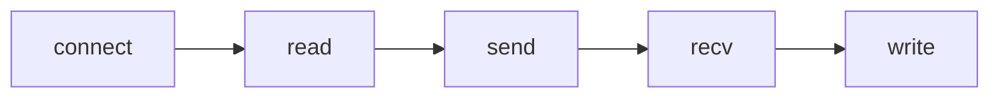

# KNN Classifier

This repository provides a server-side and a client-side system that
implements the  [k-nearest neighbors algorithm](https://en.wikipedia.org/wiki/K-nearest_neighbors_algorithm), 
using different metrics to classify new data, based on given data.

## Table Of Contents
[Getting Started](#Getting-Started)
* [Dependencies](#Dependencies)
* [Installation](#Installation)
* [Executing The Program](#Executing-The-Program)

[Design](#Design)
* [Distance](#Distance)
* [Classified and Classifier](#Classified-and-Classifier)
* [The Client And The Server](#The-Client-And-The-Server)

[Authors](#Authors)

[Acknowledgments](#Acknowledgments)


## Getting Started

### Dependencies

This project uses CMake to generate and build. In a Debian-based system you can install it via:
```bash
sudo apt install cmake
```

### Installation

Clone the repository:
```bash
git clone 'https://github.com/idokatzav/KNN-Classifier'
```

### Executing The Program

To build the program, the standard CMake workflow can be used:
```bash
mkdir -p build && cd build
cmake ..
make -j && make
```

Running the server can be achieved by:
```bash
./Server
```
Running the client:
```bash
./Client
```

## Design

### Classified, Distance and Classifier_Server

**Distance:** In order to get another level of abstraction, we've created
the pure virtual class *Distance*, and gave it some concrete
subclasses, such as *EuclideanDistance*, *ManhattanDistance*
and *ChebyshevDistance*.
```c++
class Distance {
public:
    virtual double distance(const std::vector<double>& v1, const std::vector<double>& v2) const = 0;
    virtual ~Distance() = default;
};
```
The class represents an abstract metric, and is used
to achieve generality through polymorphism at the KNN classifier.


**Classified:** The classifier must classify something, and so, from the
need of representing a point in a dataset, this class was born.
```cpp
class Classified {
private:
    std::vector<double> m_data;
    std::string m_handles;
public:
    //...
    static std::unique_ptr<Classified> fromLine(const std::string& line);
};
```

**Classifier:** It's inevitable that a program that classifies
data, will have *Classifier* class. This class is the heart
of the program. It does all the classifying and string parsing 
needed by the server:
```c++
class Classifier {
private:
    // ...
    int m_k;
    bool m_isInit;
    std::vector<std::unique_ptr<Classified>> m_classifiedResult;

public:
    // ...
    void init(const std::string& dataPath);
    
    void classify(Classified& unclassified, const Distance& metric) const;

    std::string classify(const std::string& uploadedData, const Distance& metric) const;
};
```

### I/O

In order to support multiple I/O types by the server, we created the DefaultIO class::
```c++
class DefaultIO {
    // ...
    virtual string read() = 0;
    virtual void write(string message) = 0;
};
```
By inheriting and implementing the SocketIO class, we were able to give the server a way of communication with a remote client. 

### Commands

To achieve greater flexibility, we created the pure abstract class Command:
```c++
class Command {
private:
    // ...
    std::string description;
     DefaultIO* m_dio;
    
public:
    // ...
    virtual void execute() = 0;
};
```
Each class the inherits Command and implements the execute() method, can run by the server. 


### CLI

To encapsulate the commands and their running procedure, we created the CLI class:
```c++
class Cli {
private:
    // ...
    DefaultIO* m_dio;
    std::vector<Command*> m_commands;

public:
    // ...
    void start();
};
```
The class is responsible of running the commands, using the I/O mechanic given by the server. 


### The Client And The Server

**The server:** With the above classes implemented, the creation of
the server was rather quick. The flow of the program is fairly 
simple, and best described by the following:

```mermaid
graph LR;
    Listen-->Accept;
    Accept.->Handle-First-Client-->Wait-Till-Finished;
    Accept.->Handle-First-Client-->Wait-Till-Finished;
    Accept.->Handle-Third-Client-->Wait-Till-Finished;
    Listen-.timeout.->Close;
    Wait-Till-Finished-->Close;
```
With greater details: After creating and binding a socket,
the server listens and accepts a client. When the two are connected,
the server creates a thread in order to handle multiple clients, 
and communicates with the user through the CLI it creates,
which allows the user to control the classifier's parameters, it's train files,
the files it classifies and to get an analysis of the classifications.

The server uses port 5555.

**Note:** the timeout window is 60 seconds.

<br>
<br>
**The client:** The client's workflow is also uncomplicated.
First, the client creates a socket and connects to the server.
Then, the client reads the unclassified data from the provided path,
and sends it to the server. Finally, the client receives the
classifications from the server and writes them to the provide
output path.


### Our protocol
We created a protocol which is used to let the server and user to know what to do with the input it got from the other.
**\Input**: This tags means that the part of the program that got a message which is started with that tag, will ask for input.
.
.
.


## Authors
[Jonathan Kelsi](https://github.com/JonathanKelsi)  
[Ido Katzav](https://github.com/idokatzav)

## Acknowledgments

In order to better understand C/C++, and implement some of the
algorithms we used, we've relied on the following sources:

* [Wikipedia](https://www.wikipedia.org/)
* [Stackoverflow](https://stackoverflow.com/questions)
* [die.net](https://linux.die.net/)
* [man7.org](https://man7.org/linux/man-pages/)

